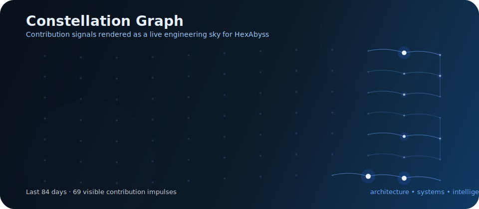
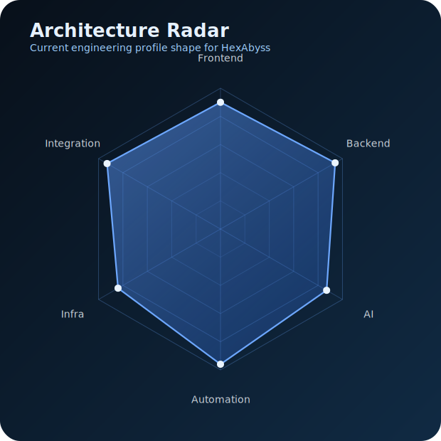
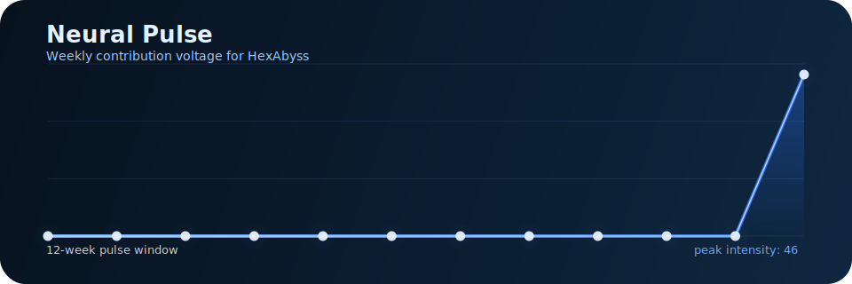

<p align="center">
	
</p>

<p align="center">
	<strong>Building intelligent systems with elegance, structure and depth.</strong>
</p>

<p align="center">
	
</p>

<p align="center">
	
	
	
	
	
</p>

---

## About Me

I design and build software systems with an architecture-first mindset.
My focus is not just shipping features, but structuring products that are scalable, typed end-to-end, operationally clear, and ready to evolve.

- 🧠 Focused on intelligent systems, software architecture, automation and AI-driven workflows.
- 🏗️ Building solutions that connect interface, backend, data, infrastructure and deployment as one coherent system.
- ⚙️ Working with modern TypeScript stacks, containerized environments and integration-oriented design.
- 🌌 Guided by clarity, depth and precision: elegant software should be both expressive and dependable.

---

## Core Projects

<table>
	<tr>
		<td width="33%" valign="top">
			<h3 align="center">OmniVoice</h3>
			<p align="center"><strong>Voice Cloning · Docker · Web UI · CPU/GPU</strong></p>
			<p>
				Multilingual voice infrastructure built for practical deployment, configurable inference and accessible control through a clean web interface.
			</p>
			<p>
				
				
				
			</p>
		</td>
		<td width="33%" valign="top">
			<h3 align="center">Atlas</h3>
			<p align="center"><strong>Local Agent · System Automation</strong></p>
			<p>
				A local intelligence layer designed to execute routines, orchestrate tasks and automate interactions across the operating environment.
			</p>
			<p>
				
				
				
			</p>
		</td>
		<td width="33%" valign="top">
			<h3 align="center">Sophya</h3>
			<p align="center"><strong>Remote AI · Atlas Integration</strong></p>
			<p>
				A remote intelligence component built to extend Atlas with higher-level reasoning, external connectivity and coordinated system behavior.
			</p>
			<p>
				
				
				
			</p>
		</td>
	</tr>
</table>

---

## Architecture Stack

```text
Next.js
   ↓
NestJS
   ↓
Prisma
   ↓
PostgreSQL
   ↓
Docker
   ↓
Deploy: Vercel + Railway / DigitalOcean
```

This stack reflects how I like to engineer products: fast interfaces, modular services, typed persistence, reproducible infrastructure and production-aware deployment.

---

## Technology Blueprint

### Frontend

<p>
	
	
	
	
</p>

### Backend

<p>
	
	
</p>

### Data Layer

<p>
	
	
</p>

### Infrastructure

<p>
	
	
	
	
</p>

### Quality

<p>
	
	
</p>

---

## Engineering Principles

- 🧱 Clean architecture over incidental complexity.
- 🔄 End-to-end typing as a design constraint, not an afterthought.
- 🧩 Clear separation of responsibilities across UI, services, data and infrastructure.
- 🤖 Automation wherever repetition introduces friction or risk.
- 📦 Deployable systems should be reproducible, observable and maintainable.
- 🎯 Technical elegance means clarity under scale, not decorative complexity.

---

## Identity and Philosophy

> I do not aim to build isolated features.
> I build systems that think clearly, integrate cleanly and evolve with intent.

<p>
	A strong software system should feel like good architecture: balanced, deliberate and deep.
	My work sits at the intersection of visual clarity, technical rigor and intelligent behavior.
</p>

---

## GitHub Analytics

<p align="center">
	
	
</p>

<p align="center">
	
</p>

<p align="center">
	
</p>

---

## Signal Layer

<p align="center">
	
</p>

<table>
	<tr>
		<td width="50%" align="center">
			
		</td>
		<td width="50%" align="center">
			
		</td>
	</tr>
</table>

These signals translate engineering identity into motion: contribution constellations, system-shape radar and a living activity pulse.

---

## Live Timeline

<!--live_timeline:start-->
- **[OmniVoice](https://github.com/HexAbyss/OmniVoice)** — Voice cloning stack with Docker delivery, web UI and CPU or GPU execution paths. • Python • updated live after workflow activation.
- **[Atlas](https://github.com/HexAbyss/Atlas)** — Local agent architecture for automating system workflows and operational routines. • TypeScript • updated live after workflow activation.
- **[Sophya](https://github.com/HexAbyss/Sophya)** — Remote intelligence layer designed to integrate with Atlas and orchestrate AI behavior. • TypeScript • updated live after workflow activation.
<!--live_timeline:end-->

---

## Current Direction

- Intelligent systems with real operational utility.
- Software architecture designed for growth, not improvisation.
- AI integrated into products, workflows and orchestration layers.
- Automation that reduces noise and increases leverage.

---

<p align="center">
	<sub>System Developer / Architect • Software, AI, Automation, Integration</sub>
</p>

<p align="center">
	
</p>
 
